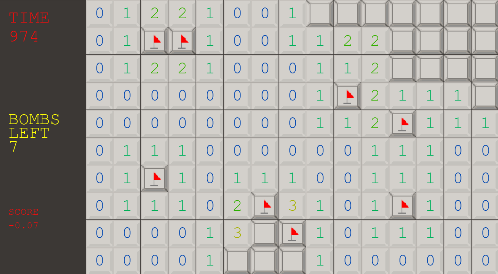
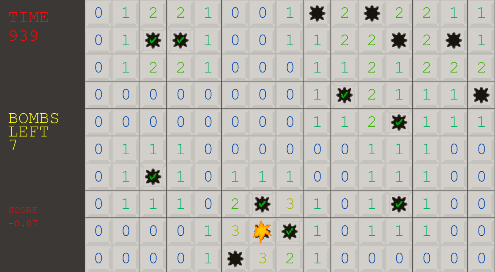

# Minesweeper
A gym-compatible Minesweeper environement !




# Installation

Using pip:
`pip install git+https://github.com/MathisFederico/Minesweeper.git`

# See examples for agent usages

## Human
If you want to play as a human, you can !
Just run the human_agent.py example !

Commands:
    - Single left click : Reveal
    - Double left click : Reveal around
    - Right click : Flag/Unflag

## Random
To see how to setup your own agent, take example on the random agent !

```
import numpy as np
from learnrl import Agent # This allow easy agent loop and logging !
from minesweeper import MinesweeperEnv

class RandomAgent(Agent):

    def __init__(self, env:MinesweeperEnv):
        pass

    def act(self, observation:np.ndarray, greedy=True):
        grid_shape = observation.shape
        return (np.random.randint(grid_shape[0]), np.random.randint(grid_shape[1]), np.random.randint(2))
    
    def learn(self):
        agent_logs = {}
        return agent_logs

    def remember(self, observation, action, reward, done, next_observation=None, info={}, **param):
        pass

if __name__ == "__main__":

    # Import and setup the environment
    from minesweeper import MinesweeperEnv
    env = MinesweeperEnv(d
        grid_shape=(10, 15),
        bombs_density=0.1,
        n_bombs=None,
        impact_size=3,
        max_time=999,
        chicken=False
    )

    # Initialize the agent
    agent = RandomAgent(env)

    # Run the agent with learnrl
    pg = rl.Playground(env, agent)
    pg.run(5, render=True, verbose=1)

```

